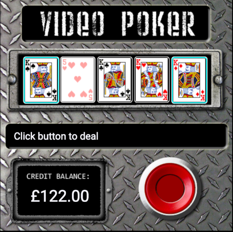

# Video Poker

This is a simple implementation of a Video Poker game.



### History

#### 2009

I originally wrote it as the winning entry for the Sun Microsystems JavaFX contest in September 2009.  The challenge was to create a JavaFX application in under 30 lines of code (or 3,000 characters) on the theme of "Five".  I choose to write a VideoPoker application.  I was pleased with the winning entry and I featured on a podcast.  I can't find any reference to it online now (except for JavaPosse [mentioning the contest](http://javaposse.com/java_posse_280_newscast_for_sept_25th_2009)).

#### 2018

I resurrected the code in 2018 and ported it to Angular2.  The goal was to generate test events for a player protection application.
This included logic to modify stakes and send events to a remote server.

#### 2025

I wanted to try my hand at Vibe Coding so this project was an excellent candidate.  That meant trawling through old backups to find the original source code (Angular only - I think the JavaFX script version is long gone).  I used Claude Code to first upgrade it from 2018 and then to remove the server logic.  I was impressed - it did a great job.  It was able to upgrade the code, refactor to simplify and add a comprehensive test suite.  I think this would have taken me around 5 days to do by myself, and it completed in a couple of hours.
code
### Requirements

- Node.js v18

### Install and run

```
npm install
npm start
```

### Test

```
ng test
```

### Card Images

source: [vector playing cards](https://code.google.com/archive/p/vector-playing-cards/)

### Strategy

- [Jacks or better perfect strategy](https://wizardofodds.com/games/video-poker/strategy/jacks-or-better/9-6/intermediate/)
